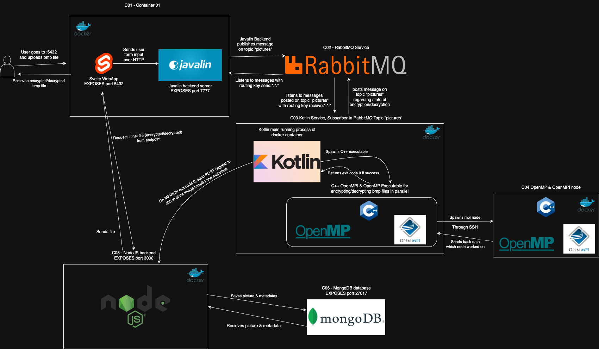

# Distributed and Parallel Systems Project

A multi-service distributed application demonstrating various parallel computing and distributed system concepts using Docker containers, message queuing, and parallel processing frameworks.

## Project Overview

Diagram:


This project implements a distributed system with multiple interconnected services that handle image processing operations using different parallel computing approaches including OpenMPI, OpenMP, and distributed messaging.

## Architecture

The system consists of 6 main services orchestrated using Docker Compose:

### Services

- **c01**: Frontend & Backend Gateway
  - Svelte TypeScript frontend (port 5432)
  - Javalin HTTP server backend (port 7777)
  - Entry point for user interactions

- **c02**: Message Queue
  - RabbitMQ message broker (port 5672)
  - Handles asynchronous communication between services

- **c03**: MPI Coordinator
  - Java application with OpenMPI/OpenMP C++ integration
  - Manages distributed parallel processing tasks
  - SSH client for communication with c04

- **c04**: MPI Worker Node
  - OpenMPI worker node
  - SSH server (port 2222) for remote execution
  - Parallel processing execution environment

- **c05**: Node.js API Server
  - Bun-based TypeScript server (port 3000)
  - MongoDB integration for data persistence
  - File upload/download operations

- **c06**: Database
  - MongoDB instance (port 27017)
  - Data storage for processed images and metadata

## Technology Stack

### Frontend
- **Svelte** with TypeScript and Vite
- Modern reactive web framework
- Build system with HMR support

### Backend Services
- **Javalin** (Kotlin/Java) - HTTP server
- **Bun/Node.js** (TypeScript) - API server
- **C++** - Parallel processing algorithms

### Parallel Computing
- **OpenMPI** - Distributed memory parallelism
- **OpenMP** - Shared memory parallelism
- **CMake** - Build system for C++ components

### Infrastructure
- **Docker** & **Docker Compose** - Containerization
- **RabbitMQ** - Message queuing
- **MongoDB** - Document database
- **SSH** - Secure inter-container communication

## Prerequisites

- Docker and Docker Compose
- At least 4GB RAM recommended
- Linux/macOS/WSL2 environment

## Quick Start

1. **Clone the repository**
   ```bash
   git clone https://github.com/Joyzyy/DistributedAndParallelSystemsProject.git
   cd DistributedAndParallelSystemsProject
   ```

2. **Build and start all services**
   ```bash
   docker-compose up --build
   ```

3. **Access the application**
   - Frontend: http://localhost:5432
   - Backend API: http://localhost:7777
   - Node.js API: http://localhost:3000
   - MongoDB: mongodb://localhost:27017

## Usage

### Image Processing Workflow

1. **Upload Images**: Use the Svelte frontend to upload image files
2. **Select Operations**: Choose from available image processing operations
3. **Processing Mode**: Select sequential or parallel processing
4. **Submit**: The system will:
   - Queue the task via RabbitMQ
   - Distribute processing across MPI nodes
   - Store results in MongoDB
   - Display processed images in the frontend

### File Requirements

- Use simple filenames without special characters
- Supported formats: `.bmp`, (maybe works with `.jpg`, `.png`)
- Example: `test.bmp` ✅, `file (1).bmp` ❌

## Known Issues

- Errors not logged properly and not shown to users
- File names with special characters may cause processing issues
- SSH connectivity between containers may take a few seconds to establish

## Development

### Individual Service Development

Each service can be developed independently:

#### Frontend (c01-fe)
```bash
cd c01-fe
bun install
bun run dev
```

#### Node.js API (c05-nodejs-mongo)
```bash
cd c05-nodejs-mongo
bun install
bun run index.ts
```

#### C++ MPI Components (c03-04-openmpi-openmp-c)
```bash
cd c03-04-openmpi-openmp-c
mkdir build && cd build
cmake ..
make
mpirun -np n --host hosts.txt executable_mpi <filename> <operation> <mode> <key>
```

### Building Individual Containers

```bash
# Frontend & Javalin backend
docker build -f Dockerfile-c01 -t c01-service .

# MPI coordinator
docker build -f Dockerfile-c03 -t c03-service .

# MPI worker
docker build -f Dockerfile-c04 -t c04-service .

# Node.js API
docker build -f Dockerfile-c05 -t c05-service .
```

## Network Architecture

All services communicate through the `internal-networks` bridge network:
- Service discovery via hostname resolution
- Isolated from external networks
- Shared volumes for SSH key exchange between MPI nodes

## Monitoring and Logs

View service logs:
```bash
# All services
docker-compose logs

# Specific service
docker-compose logs c03
```

## License

This project is for educational purposes as part of distributed and parallel systems coursework.